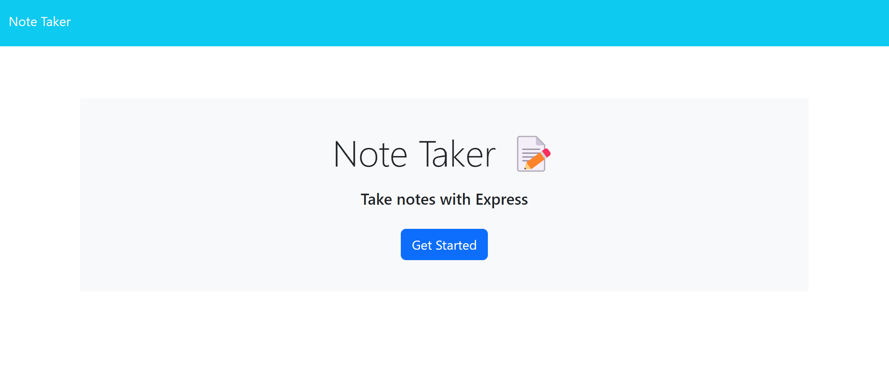
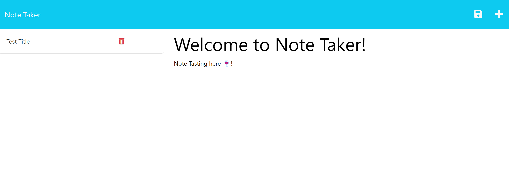
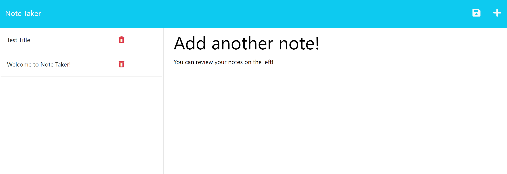
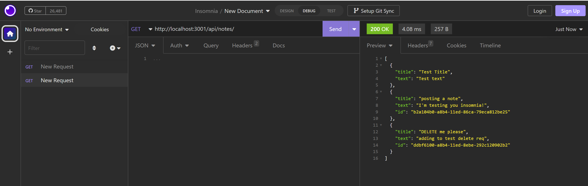
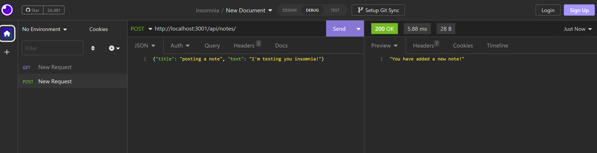
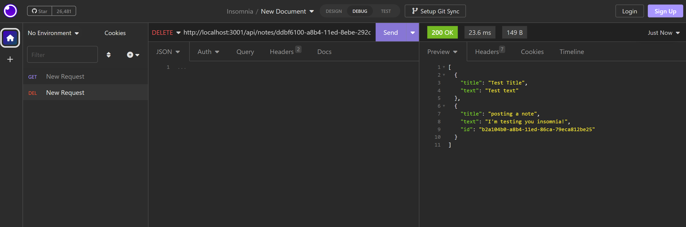

# Express Note Taker

## Description
The following application will help the user to save and delete notes as it's required.

To develop this application I have used Express js, Insomnia and Heroku.

-------------------

## Instructions

1. Click on the deployed link (deployment through Heroku).
2. Click on the "Get Started" button.
3. Add a new note by entering a title and text for the note.
4. Add another note if required doing the same thing.
5. You can delete your existing notes by clicking the delete button.

---------------------

## Installation

1. Clone code from Repository on GitHub.
2. Install the necessary dependencies.

------

## Application Documentation

* Deployed application: https://fathomless-forest-52474.herokuapp.com/

* Github Repo: https://github.com/MoMoncada/express-note-taker

---------------------

## Application Screenshots
---------------------

### Application Intro Page

### Taking notes

### Adding more notes

### Testing Insomnia GET request

### Testing Insomnia POST request

### Testing Insomnia DELETE request

## Credits
Maria Auxiliadora Moncada 

------------

## License
N/A
